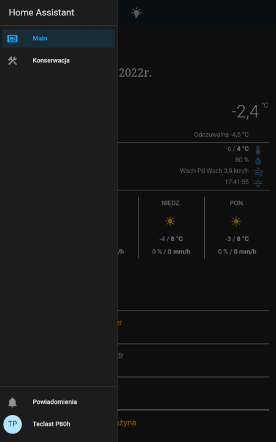

# Zollek's Home Assistant Configuration
This is my Home Assistant configuration adapted to my flat.

I've few automations mainly for heating management based on window open/close state and alarm arming mode.  
UI is designed for easy control by a non-IT person with no knowledge of the Home Assistant.

Most of the configuration is English/Polish language mix.  

## UI

## Technical

For my main panel I'm using Teclast P80 tablet.  
It's mounted on a 3D printed wall mount.  
Table charging it's controlled by an automation within 30%-80% battery level (preserves battery life).  
[Buy Teclast P80 wall mount](https://hejdom.pl/sklep/produkt/8.html)

In my weather card, for outside temperature and humidity I'm using Aquara sensor hidden in a 3D printed house shape box.  
Feels Like temperature is calculated based on that sensor reading.  
[Buy Aquara sensor house](https://hejdom.pl/sklep/produkt/3.html)

## Last word

I'm no coder and it's still work in progress so please be understanding.  
Any advice or questions are welcome.